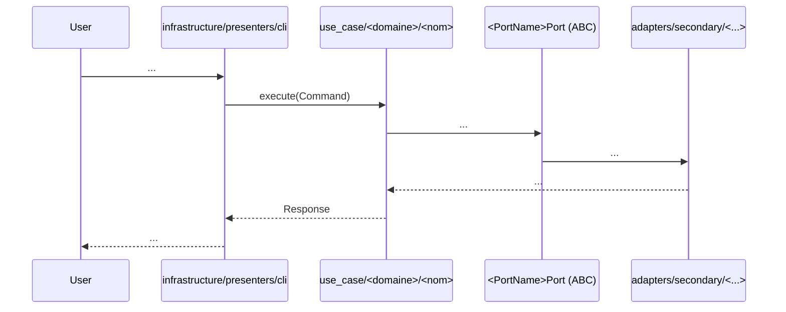

# HexAgents — Hexagonal Architecture

Hexagonal skeleton (ports & adapters), inspired by `hexawyn`, features from `agent-hermes`.
Enforced deterministically by `hexa_guard.py` (R1–R8).

## Layout

Repo root — `hexagents` (Python hexagonal core) sits under `src/backend/`;
`react/`, `flutter/` and `rust/` are separate territories at the repo root
(their own toolchain, own test suite, no shared venv with the backend):

```
src/backend/hexagents/
├── domain/                        # pure business logic — zero external deps
│   ├── errors.py                  # AgentError hierarchy
│   ├── models/                    # entities & value objects
│   └── services/                  # pure domain services
├── application/
│   ├── ports/
│   │   ├── driving/{use_case}/    # inbound — one folder per use case
│   │   └── driven/                # outbound ports (llm, terminal, storage...)
│   ├── service/                   # orchestration — no try/catch
│   └── use_case/                  # concrete implementations (command/response)
├── infrastructure/                # config, logging, memory (sqlite), adapters, presenters
│   ├── adapters/
│   │   ├── primary/                 # mcp, gateway, api (inbound)
│   │   └── secondary/               # llm, terminal, storage, web, messaging
│   └── presenters/
│       └── cli/                     # hexa CLI (click) — merged presenter, not a separate project
└── runtime/                       # agent loop + tool registry + prompts

rust/                              # hotspots behind driven ports — NEVER a layer,
                                    # an adapter detail (adapters/secondary/<hotspot>/rust.py)
react/                             # TypeScript dashboard (React/Vite)
flutter/                           # mobile client (Riverpod)
```

`adapters/` and `presenters/` live *under* `infrastructure/` on disk — that is a
filesystem grouping, not a change to the dependency direction `hexa_guard.py`
enforces: it is still `domain/ → application/ → adapters|presenters/ → infrastructure/`,
never the reverse, regardless of nesting.

## Flow

```
hexa CLI  (infrastructure/presenters/cli)
    ↓  command
application/use_case/<domaine>/<nom>/
    ├── command.py
    ├── response.py
    └── <nom>_use_case.py
    ↓  driven port (ABC)
infrastructure/adapters/secondary/    ← concrete implementation (Python — or Rust behind it)
    ↓
infrastructure/ (config, logging, sqlite)
```

## Forbidden imports (hexa_guard)

| In               | Never import |
|------------------|--------------|
| `domain/`        | `click`, `httpx`, `fastapi`, anything from application/adapters/infrastructure |
| `application/use_case/` | `adapters/`, `infrastructure/` — only ports (ABCs) |
| `adapters/`      | `domain/` directly — always go through `application/ports/` |
| `runtime/`       | LLM SDKs directly — only through the `LLMPort` |
| anywhere outside `adapters/secondary/` | the compiled `hexagents_rust` module — the port is the only interface a Rust-backed adapter is known through (R20/R21) |

## Exception strategy

- `adapters/secondary/` → catch infra, translate to an `AgentError` subclass.
- `application/service/` and `domain/services/` → never try/catch, `AgentError` propagates.
- `adapters/primary/` → final catch for user-facing display.
- Everything inherits from `AgentError` (`domain/errors.py`).

## Domain Model

```python
# src/hexagents/domain/errors.py

class AgentError(Exception):
    """Base exception for all hexagents errors."""

    def __init__(self, message: str, context: dict[str, str] | None = None) -> None:
        super().__init__(message)
        self.context = context or {}


# First 4 subclasses (skeleton, extended as phases land):
class ConfigError(AgentError): ...
class SessionError(AgentError): ...
class AdapterTimeoutError(AgentError): ...
class StorageError(AgentError): ...
```

## Implementation — Foundations

### 1. Hexagonal skeleton (UC-001)
- Tree `src/hexagents/{domain,application,adapters,infrastructure,runtime}/`
- `hexa_guard.py` enforces R1–R8: hexagonal imports, TDD (R2), secrets (R7)

### 2. Configuration (UC-002)
```python
# src/hexagents/infrastructure/config/loader.py
class ConfigLoader:
    def load(self) -> AppConfig:
        # deep merge: config.yaml → defaults → .env (secrets)
        ...
```

### 3. Logging (UC-003)
```python
# src/hexagents/infrastructure/logging/setup.py
def setup_logging(home: Path) -> None:
    # agent.log (INFO+), errors.log (WARNING+), RotatingFileHandler
    # RedactingFormatter: never write secrets to disk
    ...
```

### 4. Composition root / DI (UC-005)
```python
# src/hexagents/infrastructure/bootstrap/factory.py
def build_adapters() -> Container:
    # wiring ports → adapters, lazy imports anti-cycles
    ...
```

### 5. Session persistence (UC-007)
```python
# src/hexagents/infrastructure/adapters/secondary/storage/session_db.py
class SessionDB(SessionStorePort):
    # SQLite + FTS5: sessions, messages, full-text search
    ...
```

## Transposing hermes patterns to hexagonal

hermes-agent is a monolith. When a hermes feature is transposed, the hermes
class is **never copied as-is** — it is inverted into ports & adapters:

| hermes (provider-centric) | hexagents (hexagonal) |
|---|---|
| base class knows provider dialect (`api_mode`, conversion methods) | `Port` ABC defines what the **application** needs, one method |
| loop/consumer imports the class and builds kwargs | consumer knows only the port (guard R5) |
| conversion exposed on the class | conversion is **private** to each secondary adapter |
| adapter selected by a mode string | adapter selected by a **factory** (`build_*_adapter(config)`) consumed by the composition root (UC-005) |

Rules:
- Ports are application-driven: they express "what the app needs", never "what the provider offers".
- Provider dialects (message/tool conversion, response normalization) live inside `adapters/secondary/`, as private methods.
- Factories (`build_*_adapter`) are called by `infrastructure/bootstrap/` (UC-005), never by application code.
- `runtime/` imports only ports, never SDKs.

## Integration

Validated on every PR by:
- `make guard` → hexa_guard.py R1–R8 (mandatory)
- `make check` → lint + format-check + type-check (strict mypy)
- `make test` → all unit tests
- `make coverage` → ≥ 80%

## Edge Cases

| Edge Case | Behavior |
|---|---|
| `HEXAGENTS_HOME` unset | default to `~/.hexagents/` |
| config.yaml missing | defaults + `.env` only |
| missing API key | raise `ConfigError`, never hardcode a key |
| malformed `.env` | warn + continue with config.yaml |
| locked home directory | `ConfigError` with clear context |
| corrupted SQLite DB | `StorageError` → recreate + backup |

## TDD Workflow (non-negotiable)

1. Write the failing test → `tests/unit/test_{module_name}.py`
2. Run the test → confirm RED
3. Implement the source file
4. Run the test again → confirm GREEN
5. `make guard` → must pass

No source file without a test. No exceptions.

## Sequence diagrams in Jira tickets

Every use-case ticket MUST include a **Sequence Diagram** section, following
the hexawyn format:

- Mermaid `sequenceDiagram` code block.
- Participants named after the real layers/components (CLI, use_case, port,
  adapter, infrastructure, LLM...).
- `alt`/`loop`/`Note over` for branches and iterations.
- A **Key Points** bullet list after the diagram (design rules the diagram
  encodes — what is allowed, what is not, side effects, invariants).
- Optional **Test Coverage** table mapping tests to the flow steps.

Template:

```markdown
## Sequence Diagram



### Key Points

- ...

## Acceptance Criteria
```

## Reference

- Jira: [HEX-1 — Project bootstrap](https://onlinebook-red-line.atlassian.net/browse/HEX-1)
- Jira: [HEX-2 — UC-001 hexagonal skeleton](https://onlinebook-red-line.atlassian.net/browse/HEX-2)
- Use-cases: `use-cases/README.md` (13 phases, UC-001 → UC-310)
